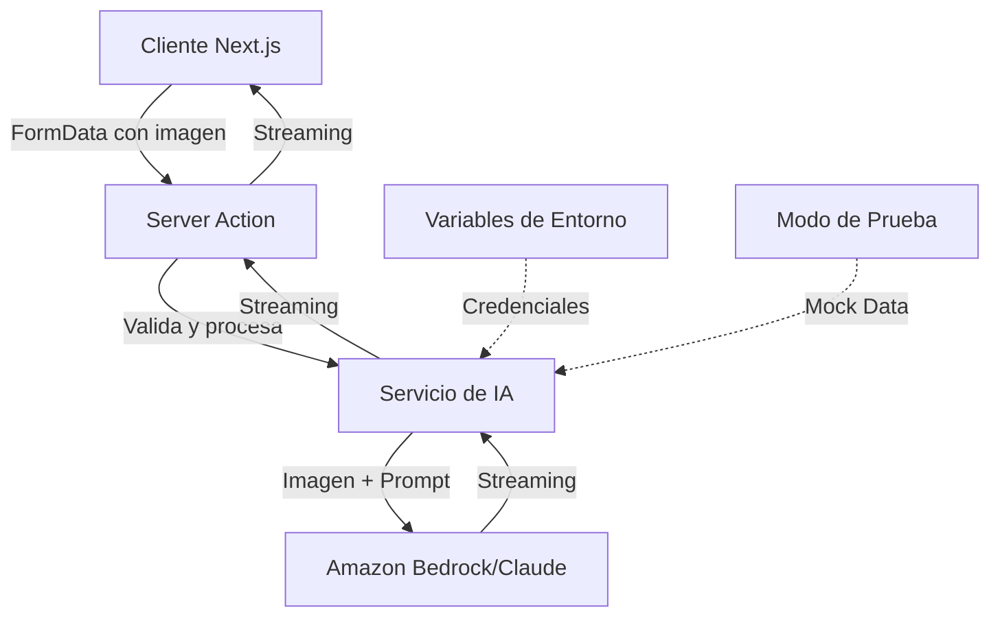

# Documento de Diseño

## Resumen

Este documento describe el diseño técnico del sistema de generación de calaveritas literarias con IA. El sistema utilizará Vercel AI SDK para integrarse con Amazon Bedrock y Claude, aprovechando las capacidades de visión de Claude para analizar imágenes de mascotas y generar calaveritas personalizadas en español.

## Arquitectura

### Diagrama de Arquitectura



### Stack Tecnológico

- **Framework**: Next.js 16 (App Router)
- **SDK de IA**: Vercel AI SDK (`ai` package)
- **Proveedor de IA**: Amazon Bedrock con Claude (`@ai-sdk/amazon-bedrock`)
- **Lenguaje**: TypeScript
- **Validación**: Zod
- **Gestión de Estado**: React hooks (useState, useTransition)

### Flujo de Datos

1. Usuario sube imagen y selecciona rasgos de personalidad
2. Cliente valida formato y tamaño de imagen
3. Server Action recibe FormData
4. Servicio de IA convierte imagen a base64
5. Servicio de IA construye prompt con contexto
6. Claude analiza imagen y genera calaverita
7. Respuesta se transmite progresivamente al cliente
8. Cliente muestra calaverita en tiempo real

## Componentes e Interfaces

### 1. Componente de Formulario (Cliente)

**Ubicación**: `app/components/CalaveritaForm.tsx`

**Responsabilidades**:

- Capturar imagen de mascota
- Mostrar selector de rasgos de personalidad
- Validar entrada del usuario
- Enviar datos al Server Action
- Mostrar calaverita generada con streaming

**Props**:

```typescript
interface CalaveritaFormProps {
  className?: string;
}
```

**Estado**:

```typescript
interface FormState {
  petName: string;
  selectedTraits: string[];
  imageFile: File | null;
  imagePreview: string | null;
  isGenerating: boolean;
  generatedCalaverita: string;
  error: string | null;
}
```

### 2. Server Action

**Ubicación**: `app/actions/generate-calaverita.ts`

**Firma**:

```typescript
export async function generateCalaverita(formData: FormData): Promise<{
  success: boolean;
  calaverita?: string;
  error?: string;
}>;
```

**Responsabilidades**:

- Validar FormData recibido
- Extraer y validar imagen
- Extraer nombre y rasgos de personalidad
- Llamar al Servicio de IA
- Manejar errores y retornar respuesta

**Validaciones**:

- Nombre de mascota: 1-50 caracteres, requerido
- Rasgos: array de strings, 1-3 elementos
- Imagen: formato JPEG/PNG/WebP, máximo 5MB

### 3. Servicio de IA

**Ubicación**: `lib/ai/calaverita-service.ts`

**Interfaz Principal**:

```typescript
export interface GenerateCalaveritaInput {
  petName: string;
  traits: string[];
  imageBuffer: Buffer;
  imageMimeType: string;
}

export interface CalaveritaServiceConfig {
  model: string;
  maxTokens: number;
  temperature: number;
  testMode: boolean;
}

export class CalaveritaService {
  constructor(config?: Partial<CalaveritaServiceConfig>);

  async generateCalaverita(
    input: GenerateCalaveritaInput
  ): Promise<ReadableStream<string>>;

  private buildPrompt(petName: string, traits: string[]): string;

  private convertImageToBase64(buffer: Buffer, mimeType: string): string;
}
```

**Configuración por Defecto**:

```typescript
const DEFAULT_CONFIG: CalaveritaServiceConfig = {
  model: "us.anthropic.claude-3-sonnet-20240229-v1:0", // ID de modelo en Bedrock
  maxTokens: 500,
  temperature: 0.8,
  testMode: process.env.NODE_ENV === "development",
};
```

### 4. Configuración de Amazon Bedrock

**Ubicación**: `lib/ai/bedrock-config.ts`

```typescript
import { createAmazonBedrock } from "@ai-sdk/amazon-bedrock";

export const bedrock = createAmazonBedrock({
  region: process.env.AWS_REGION || "us-east-1",
  accessKeyId: process.env.AWS_ACCESS_KEY_ID,
  secretAccessKey: process.env.AWS_SECRET_ACCESS_KEY,
  sessionToken: process.env.AWS_SESSION_TOKEN, // Opcional
});

// Modelo de Claude en Bedrock
// Nota: Los modelos en Bedrock tienen IDs específicos con sufijo -v1:0
export const CLAUDE_MODEL_ID = "us.anthropic.claude-3-sonnet-20240229-v1:0";
```

### 5. Utilidades de Validación

**Ubicación**: `lib/validation/calaverita-schema.ts`

```typescript
import { z } from "zod";

export const CalaveritaInputSchema = z.object({
  petName: z
    .string()
    .min(1, "El nombre es requerido")
    .max(50, "El nombre debe tener máximo 50 caracteres")
    .regex(/^[a-zA-ZáéíóúÁÉÍÓÚñÑ\s]+$/, "El nombre solo puede contener letras"),

  traits: z
    .array(z.string())
    .min(1, "Selecciona al menos un rasgo")
    .max(3, "Selecciona máximo 3 rasgos"),

  imageSize: z.number().max(5 * 1024 * 1024, "La imagen debe ser menor a 5MB"),

  imageMimeType: z.enum(["image/jpeg", "image/png", "image/webp"], {
    errorMap: () => ({ message: "Formato no soportado. Usa JPEG, PNG o WebP" }),
  }),
});

export type CalaveritaInput = z.infer<typeof CalaveritaInputSchema>;
```

## Modelos de Datos

### Rasgos de Personalidad Predefinidos

**Ubicación**: `lib/constants/pet-traits.ts`

```typescript
export const PET_TRAITS = {
  energia: [
    { value: "jugueton", label: "Juguetón/a" },
    { value: "tranquilo", label: "Tranquilo/a" },
    { value: "hiperactivo", label: "Hiperactivo/a" },
    { value: "dormilon", label: "Dormilón/a" },
  ],
  personalidad: [
    { value: "carinoso", label: "Cariñoso/a" },
    { value: "independiente", label: "Independiente" },
    { value: "travieso", label: "Travieso/a" },
    { value: "timido", label: "Tímido/a" },
    { value: "valiente", label: "Valiente" },
    { value: "miedoso", label: "Miedoso/a" },
  ],
  comportamiento: [
    { value: "gloton", label: "Glotón/a" },
    { value: "ladrador", label: "Ladrador/a" },
    { value: "protector", label: "Protector/a" },
    { value: "curioso", label: "Curioso/a" },
    { value: "obediente", label: "Obediente" },
    { value: "rebelde", label: "Rebelde" },
  ],
  especiales: [
    { value: "elegante", label: "Elegante" },
    { value: "payaso", label: "Payaso/a" },
    { value: "grunon", label: "Gruñón/a" },
    { value: "consentido", label: "Consentido/a" },
  ],
} as const;

export type TraitCategory = keyof typeof PET_TRAITS;
export type TraitValue = (typeof PET_TRAITS)[TraitCategory][number]["value"];
```

### Estructura de Prompt

El prompt para Claude seguirá esta estructura:

```typescript
const CALAVERITA_SYSTEM_PROMPT = `Eres un poeta mexicano experto en escribir calaveritas literarias.
Las calaveritas son poemas humorísticos tradicionales mexicanos sobre la muerte, escritos típicamente
para el Día de Muertos. Deben ser alegres, ingeniosas y usar referencias juguetonas a la muerte.

REGLAS ESTRICTAS:
1. Escribe SOLO en español mexicano
2. Usa estructura de cuartetas (estrofas de 4 líneas)
3. Mantén esquema de rima consistente (ABAB o ABCB)
4. Incluye humor y referencias alegres a la muerte
5. Longitud: 2-4 cuartetas (8-16 líneas)
6. Incorpora el nombre de la mascota y sus características
7. Usa lenguaje poético pero accesible`;

function buildUserPrompt(
  petName: string,
  traits: string[],
  imageBase64: string
): MessageContent[] {
  return [
    {
      type: "image",
      image: imageBase64,
    },
    {
      type: "text",
      text: `Analiza esta imagen y escribe una calaverita literaria para ${petName}.

Rasgos de personalidad: ${traits.join(", ")}

Incorpora tanto las características visuales que observes en la imagen como los rasgos de personalidad proporcionados.
La calaverita debe ser auténtica, divertida y respetuosa con la tradición mexicana.`,
    },
  ];
}
```

## Manejo de Errores

### Estrategia de Errores

```typescript
export class CalaveritaError extends Error {
  constructor(
    message: string,
    public code: ErrorCode,
    public statusCode: number = 500
  ) {
    super(message);
    this.name = "CalaveritaError";
  }
}

export enum ErrorCode {
  INVALID_IMAGE_FORMAT = "INVALID_IMAGE_FORMAT",
  IMAGE_TOO_LARGE = "IMAGE_TOO_LARGE",
  INVALID_INPUT = "INVALID_INPUT",
  AI_SERVICE_ERROR = "AI_SERVICE_ERROR",
  RATE_LIMIT_EXCEEDED = "RATE_LIMIT_EXCEEDED",
  TIMEOUT = "TIMEOUT",
  MISSING_CREDENTIALS = "MISSING_CREDENTIALS",
}

export const ERROR_MESSAGES: Record<ErrorCode, string> = {
  [ErrorCode.INVALID_IMAGE_FORMAT]:
    "Formato de imagen no válido. Por favor usa JPEG, PNG o WebP.",
  [ErrorCode.IMAGE_TOO_LARGE]:
    "La imagen es demasiado grande. El tamaño máximo es 5MB.",
  [ErrorCode.INVALID_INPUT]:
    "Los datos proporcionados no son válidos. Verifica el nombre y los rasgos.",
  [ErrorCode.AI_SERVICE_ERROR]:
    "Hubo un problema al generar tu calaverita. Por favor intenta de nuevo.",
  [ErrorCode.RATE_LIMIT_EXCEEDED]:
    "Has alcanzado el límite de solicitudes. Por favor intenta más tarde.",
  [ErrorCode.TIMEOUT]:
    "La generación está tomando demasiado tiempo. Por favor intenta de nuevo.",
  [ErrorCode.MISSING_CREDENTIALS]:
    "Configuración del servicio incompleta. Contacta al administrador.",
};
```

### Manejo de Errores en Server Action

```typescript
export async function generateCalaverita(formData: FormData) {
  try {
    // Validación y procesamiento
    const input = await validateAndProcessInput(formData);

    // Generación
    const service = new CalaveritaService();
    const stream = await service.generateCalaverita(input);

    return { success: true, stream };
  } catch (error) {
    if (error instanceof CalaveritaError) {
      console.error(`[CalaveritaError] ${error.code}:`, error.message);
      return {
        success: false,
        error: ERROR_MESSAGES[error.code],
      };
    }

    if (error instanceof z.ZodError) {
      console.error("[ValidationError]:", error.errors);
      return {
        success: false,
        error: error.errors[0].message,
      };
    }

    // Error desconocido
    console.error("[UnknownError]:", error);
    return {
      success: false,
      error: "Ocurrió un error inesperado. Por favor intenta de nuevo.",
    };
  }
}
```

### Logging

```typescript
interface LogContext {
  requestId: string;
  timestamp: string;
  userId?: string;
  petName?: string;
  errorCode?: ErrorCode;
  duration?: number;
}

export function logCalaveritaGeneration(
  context: LogContext,
  level: "info" | "error" | "warn"
) {
  const logEntry = {
    level,
    service: "calaverita-generation",
    ...context,
  };

  console[level](JSON.stringify(logEntry));
}
```

## Estrategia de Testing

### Modo de Prueba

El sistema incluirá un modo de prueba que no consume créditos de API:

```typescript
// lib/ai/mock-service.ts
export class MockCalaveritaService {
  async generateCalaverita(
    input: GenerateCalaveritaInput
  ): Promise<ReadableStream<string>> {
    const mockCalaverita = `
La muerte buscaba a ${input.petName}
${
  input.traits.includes("jugueton")
    ? "jugando con su pelota"
    : "descansando en su lugar"
}
pero al verlo tan ${input.traits[0]}
decidió dejarlo un rato más

Con sus ${input.traits[1]} maneras
y su mirada tan especial
la calaca dijo "¡qué ternura!"
y lo dejó en paz
    `.trim();

    // Simular streaming
    return createMockStream(mockCalaverita);
  }
}

function createMockStream(text: string): ReadableStream<string> {
  const words = text.split(" ");
  let index = 0;

  return new ReadableStream({
    async pull(controller) {
      if (index < words.length) {
        controller.enqueue(words[index] + " ");
        index++;
        await new Promise((resolve) => setTimeout(resolve, 50));
      } else {
        controller.close();
      }
    },
  });
}
```

### Variables de Entorno

```bash
# .env.local
# Credenciales de AWS para Bedrock
AWS_REGION=us-east-1
AWS_ACCESS_KEY_ID=your_access_key
AWS_SECRET_ACCESS_KEY=your_secret_key
AWS_SESSION_TOKEN=your_session_token  # Opcional, solo si usas credenciales temporales

# Configuración del modelo (ID de modelo en Bedrock)
CLAUDE_MODEL_ID=us.anthropic.claude-3-sonnet-20240229-v1:0

# Modo de prueba (true/false)
AI_TEST_MODE=false

# Configuración de timeouts (en segundos)
AI_VISION_TIMEOUT=10
AI_GENERATION_TIMEOUT=30
```

### Validación de Configuración

```typescript
// lib/config/validate-env.ts
import { z } from "zod";

const EnvSchema = z
  .object({
    AWS_REGION: z.string().optional(),
    AWS_ACCESS_KEY_ID: z.string().optional(),
    AWS_SECRET_ACCESS_KEY: z.string().optional(),
    AWS_SESSION_TOKEN: z.string().optional(),
    CLAUDE_MODEL_ID: z
      .string()
      .default("us.anthropic.claude-3-sonnet-20240229-v1:0"),
    AI_TEST_MODE: z
      .string()
      .transform((val) => val === "true")
      .default("false"),
    AI_VISION_TIMEOUT: z.string().transform(Number).default("10"),
    AI_GENERATION_TIMEOUT: z.string().transform(Number).default("30"),
  })
  .refine(
    (data) => {
      // Requiere credenciales de AWS completas o modo de prueba
      const hasAWSCreds =
        data.AWS_ACCESS_KEY_ID && data.AWS_SECRET_ACCESS_KEY && data.AWS_REGION;
      return hasAWSCreds || data.AI_TEST_MODE;
    },
    {
      message:
        "Se requieren credenciales de AWS completas (AWS_ACCESS_KEY_ID, AWS_SECRET_ACCESS_KEY, AWS_REGION) o habilitar AI_TEST_MODE",
    }
  );

export type Env = z.infer<typeof EnvSchema>;

export function validateEnv(): Env {
  try {
    return EnvSchema.parse(process.env);
  } catch (error) {
    if (error instanceof z.ZodError) {
      console.error("❌ Error de configuración:", error.errors);
      throw new CalaveritaError(
        "Configuración de ambiente inválida",
        ErrorCode.MISSING_CREDENTIALS,
        500
      );
    }
    throw error;
  }
}
```

## Consideraciones de Seguridad

### 1. Protección de Credenciales

- Todas las credenciales se almacenan en variables de entorno
- Nunca se exponen al cliente
- Validación en tiempo de inicio de la aplicación

### 2. Sanitización de Entrada

- Validación estricta con Zod
- Límites de tamaño de archivo
- Validación de tipos MIME
- Escape de caracteres especiales en nombres

### 3. Rate Limiting

```typescript
// lib/rate-limit/limiter.ts
import { Ratelimit } from "@upstash/ratelimit";
import { Redis } from "@upstash/redis";

export const ratelimit = new Ratelimit({
  redis: Redis.fromEnv(),
  limiter: Ratelimit.slidingWindow(5, "1 h"), // 5 requests por hora
  analytics: true,
});

export async function checkRateLimit(identifier: string) {
  const { success, limit, remaining, reset } = await ratelimit.limit(
    identifier
  );

  if (!success) {
    throw new CalaveritaError(
      `Límite de solicitudes excedido. Intenta de nuevo en ${Math.ceil(
        (reset - Date.now()) / 1000 / 60
      )} minutos.`,
      ErrorCode.RATE_LIMIT_EXCEEDED,
      429
    );
  }

  return { remaining, reset };
}
```

### 4. Timeouts

- Timeout de 10 segundos para análisis de visión
- Timeout de 30 segundos para generación completa
- Cancelación automática de requests que excedan límites

## Optimizaciones de Performance

### 1. Streaming de Respuesta

- Uso de `streamText` de Vercel AI SDK
- Transmisión progresiva al cliente
- Mejora percepción de velocidad

### 2. Compresión de Imágenes (Cliente)

```typescript
// lib/utils/image-compression.ts
export async function compressImage(
  file: File,
  maxSizeMB: number = 5
): Promise<File> {
  if (file.size <= maxSizeMB * 1024 * 1024) {
    return file;
  }

  // Implementar compresión con canvas si es necesario
  // ...
}
```

### 3. Caché de Prompts

- Considerar caché de prompts similares
- Reducir costos de API
- Implementación futura con Redis

## Decisiones de Diseño

### 1. ¿Por qué Vercel AI SDK con Amazon Bedrock Provider en lugar de AWS SDK directo?

- Abstracción más simple y limpia que el AWS SDK
- Soporte nativo para streaming de respuestas
- Mejor integración con Next.js y React
- API consistente con otros proveedores de IA
- Manejo automático de conversión de mensajes y formatos
- Soporte integrado para imágenes y archivos

### 2. ¿Por qué Server Actions en lugar de API Routes?

- Menos boilerplate
- Type-safety automático
- Mejor integración con React
- Simplifica manejo de FormData
- Perfecto para operaciones de mutación

### 3. ¿Por qué rasgos predefinidos en lugar de texto libre?

- Mejor calidad de calaveritas (prompts más consistentes)
- Previene entrada inapropiada
- Simplifica UX
- Facilita análisis y mejoras futuras

### 4. ¿Por qué Claude en lugar de otros modelos?

- Excelente capacidad de visión
- Fuerte en tareas creativas y de escritura
- Buen manejo de español
- Capacidad de seguir instrucciones complejas de estilo

## Próximos Pasos

Después de implementar este diseño, considerar:

1. **Almacenamiento de calaveritas** (Vercel Blob + metadata)
2. **Compartir en redes sociales**
3. **Galería pública de calaveritas**
4. **Personalización de estilo** (formal, chistoso, emotivo)
5. **Soporte para múltiples mascotas**
6. **Generación de imágenes** (ilustraciones de las calaveritas)
